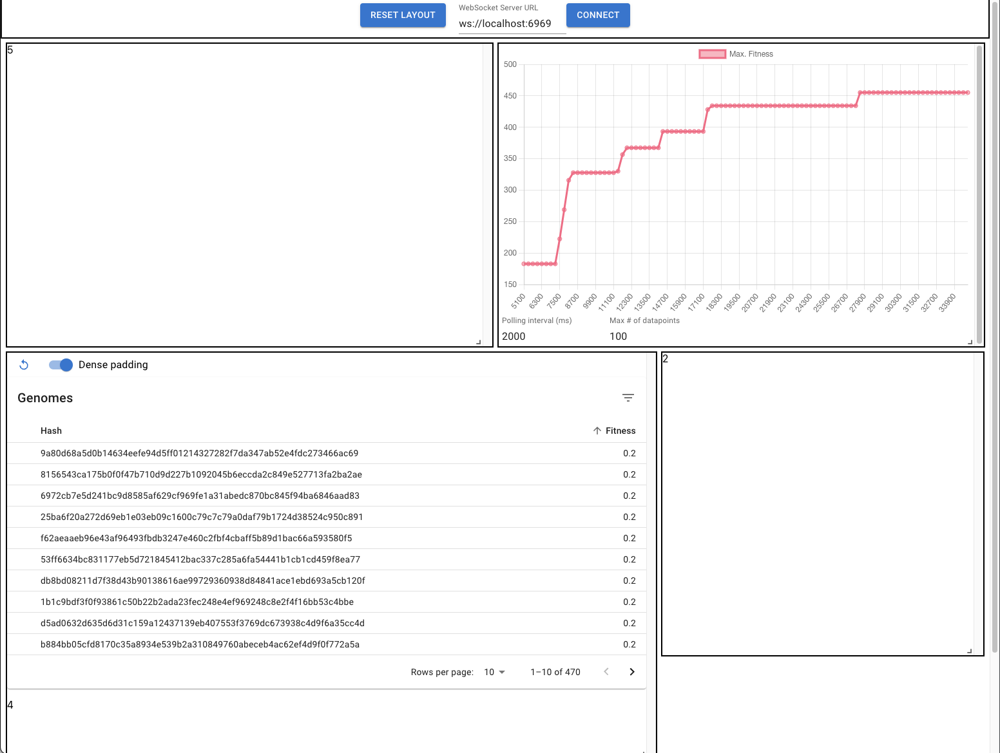
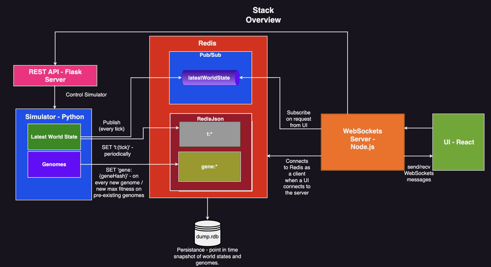

# SimpleLife - A 2D Artificial Life Sim
See [Simulator Overview](#simulator-overview) for information specfically regarding
the simulator itself which includes an extensive overview of creatures (genomes, brains, etc.), food, world mechanics, etc.

https://user-images.githubusercontent.com/49330057/206451231-130c9e0a-e654-4da1-aed7-58bc2bc2df69.mp4

## Goals
- Streamlined - Stay simple.
- Speed - The simulator itself should be fast, and the chosen data store solution (redis) should be able to keep up with it at a reasonable rate. 
  - Trying to hit ~20FPS with `MIN_CREATURES=20`, `WORLDSIZE=(1500,1500)` and `DB_UPDATE_INC=1` on a Macbook Air M1 w/ 8GB RAM
    - The simulator is primarily bottlenecked by world state serialization and writes to redis (takes ~50ms so 20FPS). 
- Distributed - Every major component should be able to run on seperate machines (Simulator, DB, Websockets Server, Frontend)

## Configuration
Edit simulator constants in [config.json](./config.json)\*\
Wouldn't recommend touching [docker-compose.yaml](./docker-compose.yaml) or anything
docker related for now.

\***NOTE:** [config.json](./config.json) gets overwritten on every run of the simulator 
when it is connected to redis, so it is highly recommended to keep a copy of it config in [config.temp.json](./config.json).
## Setup 
### Install simulator dependencies
```
pip install requirements.txt
```
### Standalone - no persistance - stupid fast
```
python3 renderer.py
```
### With Redis - has persistance
```
docker compose up -d
python3 redis_renderer.py
```

The config file for redis, is in `redis/redis-stack.conf`. Point-in-time snapshots of the redis database are stored in `redis/data/dump.rdb`

### WebSockets Servers
**Go:**
```
cd go_server
go build .
./go_server 
```

**Node JS:**
  ```
  cd ./api
  yarn
  yarn start
  ```
  There's also a simple WS client that can be run to test out a local WS server:
  ```
  node src/testClient.js
``` 

### Web Interface - WIP
Ensure you have both the Redis and Websocket server instances running beforehand.
```
cd app
yarn
yarn start
```
It's currently a work in progress and looks kinda eh at the moment...


### Extras
- Run with env. var `ALIFE_HEADLESS=1` to trick sdl into using a dummy display driver when running `redis_renderer.py` - can be used to 
run on machines without a display.
### Simulator Keybinds (not available in headless mode)
- `q` - toggles window draw updates
- `p`  - pauses the simulator 

### REST API:
Currently, a toy implementation of a REST API using Flask is used to pause the simulator. This is useful if it is run in 
headless mode since pygame cannot process input. Just run `python server.py`. Since this implementation currently uses [shared memory](https://docs.python.org/3/library/multiprocessing.shared_memory.html) to modify the `pauseSimulation` buffer it requires python 3.8+ to run.
Using the API is pretty self explanatory: 
- `POST` request to the `/togglePause` endpoint to toggle pausing the sim.
- `POST` request to `/setPause/{int:pause}` with `{int:pause}` being an integer (ideally `0` or `1`) to pause/play the sim.
- `GET`  request to `/getPause` gets the pause status of the simulation.

## TODO - sorted by priority:
- Finish writing UI.
- Finish writing [Simulator Overview](#simulator-overview) section.
- Connect the WebSocket server to the REST API
- Optimize the living crap out of the simulator.
  - Add unit testing for Creatures, Food, and World
  - Make sure to test gene hash consistency between data on redis and simulator memory

## <a name="arch"></a> Architecture:


## <a name="sim-overview"></a> Simulator Overview - Components
**TODO: add more stuff here**

<!-- The simulator contains insect-like creatures that eat, reproduce, repeat. -->

### World
The "World" houses its creatures and food sources. The `World` class is defined in `world.py`, and contains the following attributes: 
  - 2D border dimensions
  - Maximum fitness observed of all creatures that every existed
  - List of creatures 
  - List of foods
  - Current tick
  - and finally, the latest state of numpy and PyTorch's RNG

### Creatures
The simulator contains creatures which basically resemble insects. Their physiology and neuroactivities are defined by their [genomes](#genomes). They have two antennae that are used to sense color, along with a sensor centered at their abdomen that is used to detect food and creatures.

### <a name="genomes"></a> Genomes - TODO

