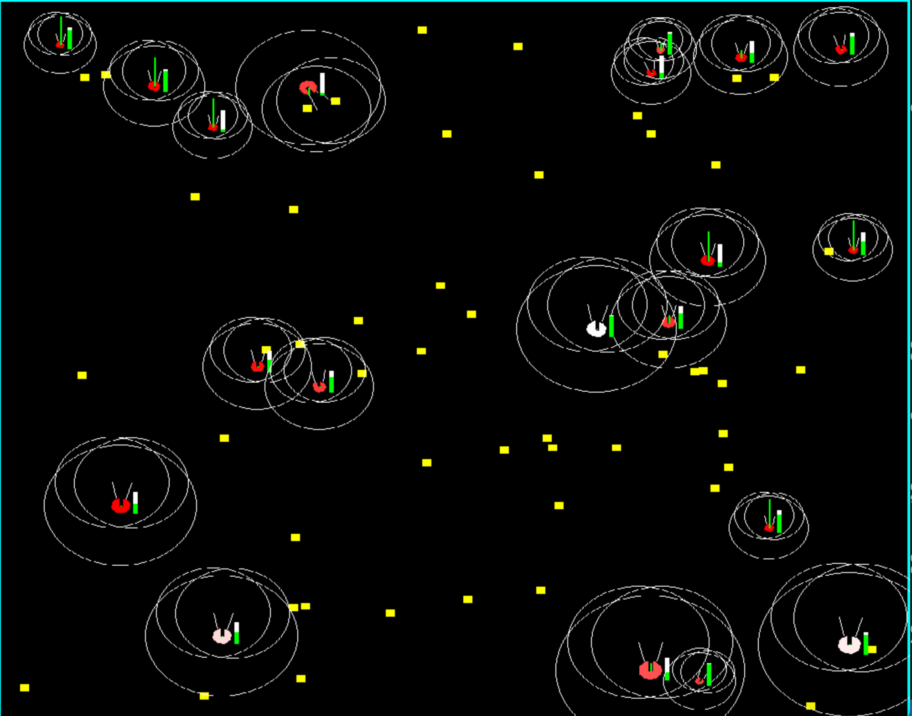

## SimpleLife - A Simple 2D Artificial Life Sim

### Configuration
Edit constants in `config.py`

### Run
`python3 renderer.py`

### TODO:
 - Implement better fitness function
 - Sexual reproduction vs. Asexual reproduction?
 - Optimize the living s**t out of the code - probs unnecessary cos this is just a prototype, I plan on building a more mature verison of this in a compiled like language C++ or perhaps Rust.
